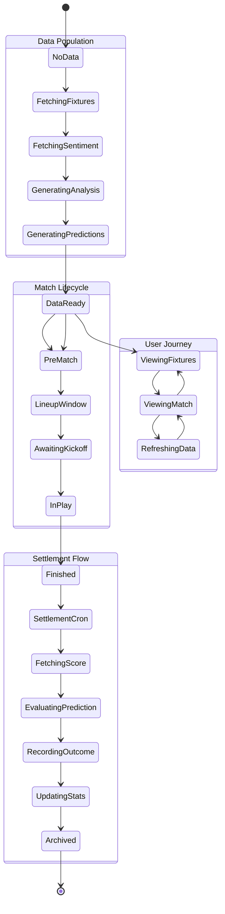
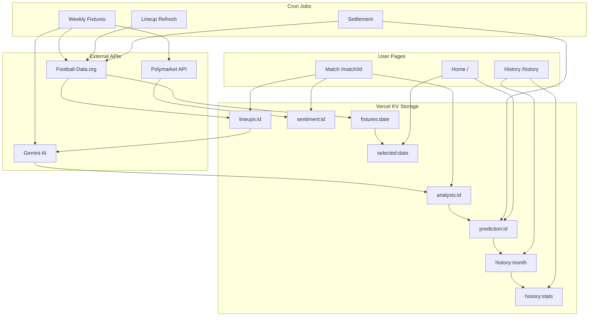

# BetPrompter Application Flow

## System State Diagram

### State Descriptions

| State | Description |
|-------|-------------|
| NoData | App start, no fixtures loaded |
| FetchingFixtures | Weekly cron fetches from Football-Data.org |
| FetchingSentiment | Fetching odds from Polymarket |
| GeneratingAnalysis | AI analysis via Gemini |
| GeneratingPredictions | Classifying as BANKER/VALUE/RISKY |
| DataReady | Data available for users |
| PreMatch | More than 55 min before kickoff |
| LineupWindow | 50-55 min before kickoff, fetch lineups |
| AwaitingKickoff | Lineups confirmed, waiting for match |
| InPlay | Match in progress |
| Finished | Match ended |
| SettlementCron | Daily 23:00 GMT+1 job |
| Archived | Outcome saved to history |

## Data Flow Diagram

## Key Entities & TTLs

| Entity | Key Pattern | TTL | Purpose |
|--------|-------------|-----|---------|
| Daily Fixtures | `fixtures:YYYY-MM-DD` | 24h | All fixtures for a date |
| Single Fixture | `fixture:fixtureId` | 48h | Individual fixture details |
| Selected Fixtures | `selected:YYYY-MM-DD` | 24h | IDs of curated fixtures |
| Sentiment | `sentiment:fixtureId` | 30min | Polymarket odds |
| AI Analysis | `analysis:fixtureId` | 24h | Gemini analysis |
| Prediction | `prediction:fixtureId` | 48h | BANKER/VALUE/RISKY |
| Lineups | `lineups:fixtureId` | 24h | Confirmed lineups |
| Monthly History | `history:YYYY-MM` | No TTL | Archived outcomes |
| Stats | `history:stats` | No TTL | Aggregate statistics |

## Cron Schedule

| Job | Schedule (UTC) | Schedule (GMT+1) | Purpose |
|-----|----------------|------------------|---------|
| Weekly Fixtures | `0 21 * * 0` | Sunday 22:00 | Fetch upcoming week |
| Settlement | `0 22 * * *` | Daily 23:00 | Archive finished matches |

## Known Issues

### 1. Settlement Only Checks Today
The settlement job only looks at today's fixtures. If it fails on a given day, those matches are **never settled** and lost forever due to TTL expiration.

### 2. No Daily Fixtures Cron
There's no daily fixtures job - only weekly. If the Sunday job fails, the entire week has no data.

### 3. Data TTL vs Settlement Timing
- Fixtures expire after 48h
- Predictions expire after 48h
- If settlement doesn't run within 48h of a match, the data is gone

## Recommended Fixes

1. **Settlement should check multiple days** - Look back 7 days for unsettled matches
2. **Add a daily fallback cron** - Run daily-fixtures at 05:00 to catch any missed fixtures
3. **Extend TTLs** - Increase fixture/prediction TTL to 7 days
4. **Add settlement retry logic** - Track which matches have been settled
